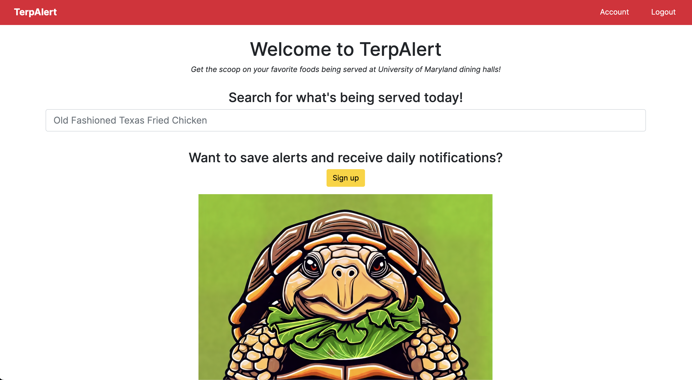

  

# TerpAlert
A web application to track foods being served at University of Maryland dining halls

[Live site](https://terpalert.xyz)

## About The Project

During my freshman year at the University of Maryland, I discovered my favorite food at the dining halls: Orange Tempura Chicken.
If I could, I would eat it for every meal. However, the dining halls did not serve it every day, so I was often left guessing what I would have for my next meal.
After bringing this issue up with my friends, I found that we shared a common desire: to know when the dining halls are serving our favorite foods.
Thus, TerpAlert was born.

### Built With
* [![Django][Django.com]][Django-url]
* [![Bootstrap][Bootstrap.com]][Bootstrap-url]
* [![JQuery][JQuery.com]][JQuery-url]
* [![BeautifulSoup][BeautifulSoup.com]][BeautifulSoup-url]
* [![PostgreSQL][Postgres.com]][Postgres-url]
* [![DigitalOcean][DigitalOcean.com]][DigitalOcean-url]
* [![Python][Python.com]][Python-url]
* [![JS][JS.com]][JS-url]

## Project Screen Shot(s)

#### Example:   

[ PRETEND SCREEN SHOT IS HERE ]

[ PRETEND OTHER SCREEN SHOT IS HERE ]

## Reflection

  - What was the context for this project? (ie: was this a side project? was this for Turing? was this for an experiment?)
  - What did you set out to build?
  - Why was this project challenging and therefore a really good learning experience?
  - What were some unexpected obstacles?
  - What tools did you use to implement this project?
      - This might seem obvious because you are IN this codebase, but to all other humans now is the time to talk about why you chose webpack instead of create react app, or D3, or vanilla JS instead of a framework etc. Brag about your choices and justify them here.  

#### Example:  

<!-- MARKDOWN LINKS & IMAGES -->
[Django.com]: https://www.djangoproject.com/m/img/badges/djangomade124x25.gif
[Django-url]: https://www.djangoproject.com
[Bootstrap.com]: https://img.shields.io/badge/Bootstrap-563D7C?style=for-the-badge&logo=bootstrap&logoColor=white
[Bootstrap-url]: https://getbootstrap.com
[JQuery.com]: https://img.shields.io/badge/jQuery-0769AD?style=for-the-badge&logo=jquery&logoColor=white
[JQuery-url]: https://jquery.com
[BeautifulSoup.com]: https://shields.io/badge/BeautifulSoup-4-green
[BeautifulSoup-url]: https://beautiful-soup-4.readthedocs.io/
[Postgres.com]: https://img.shields.io/badge/postgresql-4169e1?style=for-the-badge&logo=postgresql&logoColor=white
[Postgres-url]: https://www.postgresql.org/
[DigitalOcean.com]: https://img.shields.io/badge/-Digital_Ocean-blue?style=for-the-badge&logo=digitalocean&logoColor=white
[DigitalOcean-url]: https://digitalocean.com/
[Python.com]: https://img.shields.io/badge/python-3670A0?style=for-the-badge&logo=python&logoColor=ffdd54
[Python-url]: https://www.python.org/
[JS.com]: https://shields.io/badge/JavaScript-F7DF1E?logo=JavaScript&logoColor=000&style=flat-square
[JS-url]: https://www.javascript.com/